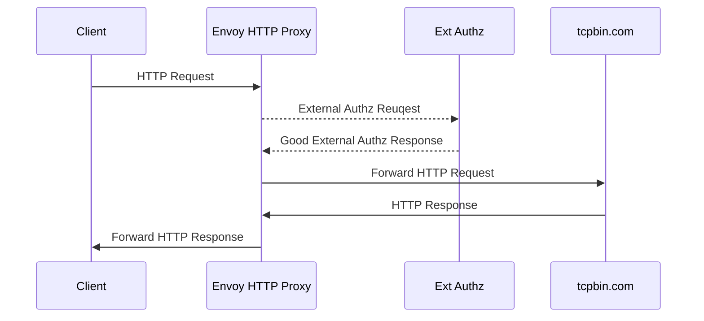

Envoy prod [docker image repo](https://hub.docker.com/r/envoyproxy/envoy/tags).

This is a demo about Envoy HTTP proxy with external authz, the ext authz server
is in ext_authz_server folder(gRPC server). The workflow is as below:

> NOTE: The envoy configuration supports both HTTP and HTTPS(CONNECT) access,
see below example.



You can run demo and examine the logs and results by following commands:
```bash
# Run below commands in the tcp-proxy-ext-authz directory.
# Need to forcely rebuild the image for updated configurations.
docker-compose up -d --build

# Track envoy logs 
# The log is self-explanatory, you will see the request and response header to
# and from ext authz grpc server, for example:
# ':method', 'POST'
# ':path', '/envoy.service.auth.v3.Authorization/Check'
# ':authority', 'just_a_test'
# ':scheme', 'http'
# 'te', 'trailers'
# 'grpc-timeout', '2000m'
# 'content-type', 'application/grpc'
# 'x-pc-alias', 'apple'
# 'x-pc-id', '888888-777777-6666666-555555'
# 'x-envoy-internal', 'true'
# 'x-forwarded-for', '172.20.0.2'
# 'x-envoy-expected-rq-timeout-ms', '2000'
docker logs -f envoy-http-proxy

# Track external authz logs.
# In the server code print both request and context metadata.
docker logs -f ext-authz-server

# Open 1 terminal for vm1
docker exec -it vm1 sh

# Envoy tcp proxy test
curl -v -x "envoy-http-proxy:10000" "http://www.httpbin.org/ip"
# apple tree! will appear in request object rather than context metadata.
curl -v -H "Host: www.httpbin.org" -H "Custom: apple tree!" "envoy-http-proxy:10000/ip"

curl -v -x "envoy-http-proxy:10000" "https://www.httpbin.org/ip"

# Remove all attached volumes
docker-compose down -v
# Remove all existing images
docker-compose down -v --rmi all
```
