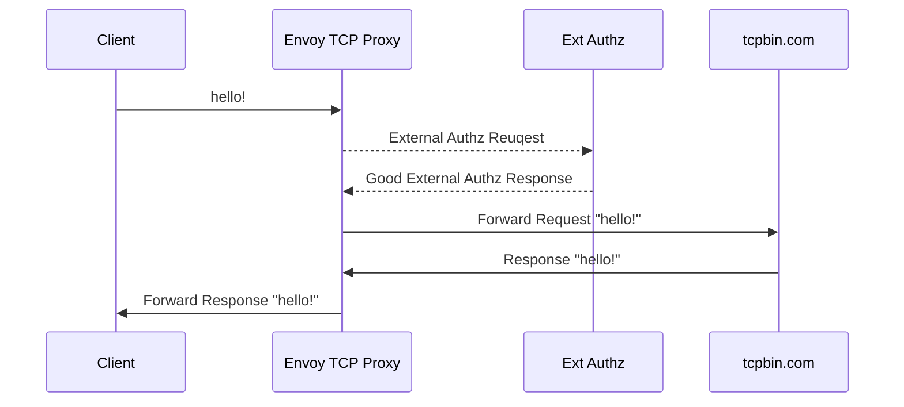

Envoy prod [docker image repo](https://hub.docker.com/r/envoyproxy/envoy/tags).

This is a demo about Envoy TCP proxy with external authz, the ext authz server
is in ext_authz_server folder(gRPC server). The workflow is as below:



You can run demo and examine the logs and results by following commands:
```bash
# Run below commands in the tcp-proxy-ext-authz directory.
# Need to forcely rebuild the image for updated configurations.
docker-compose up -d --build

# Track envoy logs 
# The log is self-explanatory, you will see the request and response header to
# and from ext authz grpc server, for example:
# ':method', 'POST'
# ':path', '/envoy.service.auth.v3.Authorization/Check'
# ':authority', 'just_a_test'
# ':scheme', 'http'
# 'te', 'trailers'
# 'grpc-timeout', '2000m'
# 'content-type', 'application/grpc'
# 'x-fake-hello', 'world'
# 'x-fake-id', '11111-22222-33333'
# 'x-envoy-internal', 'true'
# 'x-forwarded-for', '172.19.0.3'
# 'x-envoy-expected-rq-timeout-ms', '2000'
docker logs -f envoy-tcp-proxy

# Track external authz logs.
# In the server code print both request and context metadata.
docker logs -f ext-authz-server

# Open 1 terminal for vm1
docker exec -it vm1 sh

# Envoy tcp proxy test
nc envoy-tcp-proxy 10000

# Remove all attached volumes
docker-compose down -v
# Remove all existing images
docker-compose down -v --rmi all
```
